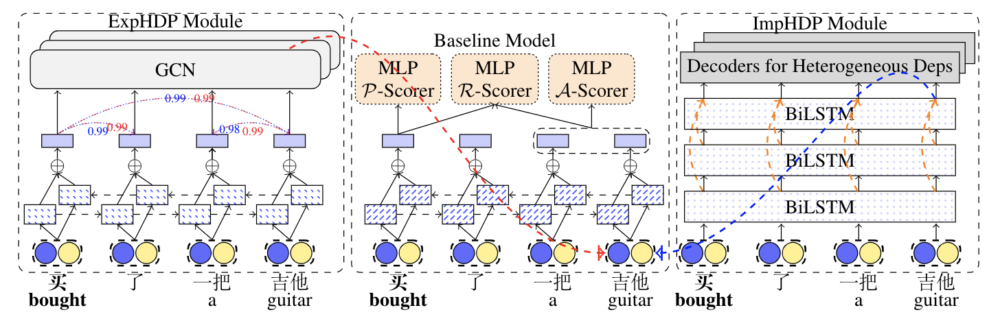

# Semantic Role Labeling with Heterogeneous Syntactic Knowledge
Code for our **COLING-2020** paper,

**Semantic Role Labeling with Heterogeneous Syntactic Knowledge**

Qingrong Xia, Rui Wang, Zhenghua Li, Yue Zhang, and Min Zhang



## Requirements
Python2, Pytorch0.4.1

## Data
### SRL Data
We conduct experiments on both Chinese and English SRL datasets, i.e, CPB1.0 and CoNLL-2005.
Please follow [Chinese-SRL](https://github.com/KiroSummer/A_Syntax-aware_MTL_Framework_for_Chinese_SRL) for the data prepration of CPB1.0 and [lsgn](https://github.com/luheng/lsgn) for the data prepration of CoNLL-2005.

### Dependency Data
For Chinese, we use the PCTB and CDT as the dependency treebanks.
For English, we use the PTB and UD as the dependency treebanks.


### Training
```
bash train.sh GPU_ID
```
### Test
```
bash predict.sh GPU_ID
```
